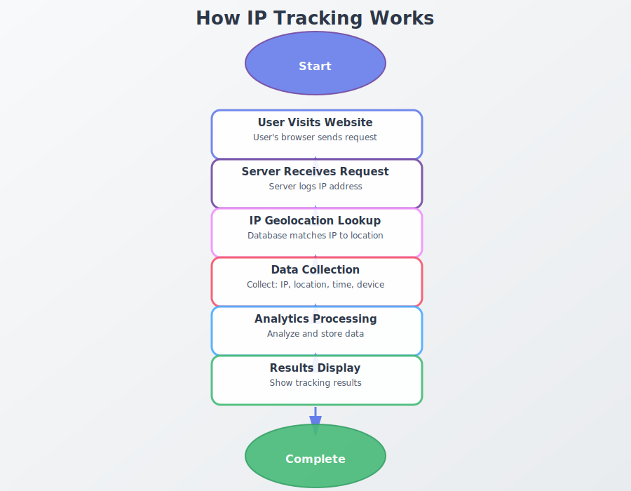

# 流程图索引

## 📊 已生成的流程图列表

### 英文流程图 (en/)

1. **ip-tracking-process-flow.svg**
   - 对应文章：`ip-tracker-how-to-find-someones-ip-complete-guide.html`
   - 类型：流程类
   - 描述：IP追踪完整流程

2. **how-ip-tracking-works.svg**
   - 对应文章：`how-ip-tracking-works.html`
   - 类型：流程类
   - 描述：IP追踪工作原理

3. **ip-tracker-vs-ip-grabber.svg**
   - 对应文章：`ip-tracker-vs-ip-grabber-guide.html`
   - 类型：对比类
   - 描述：IP追踪器 vs IP抓取器对比

4. **email-tracking-process-flow.svg**
   - 对应文章：`email-tracking-best-practices.html`
   - 类型：流程类
   - 描述：邮件追踪流程

5. **ip-address-structure.svg**
   - 对应文章：`ip-address-basics.html`
   - 类型：结构类
   - 描述：IP地址结构（IPv4 vs IPv6）

6. **link-tracking-process-flow.svg**
   - 对应文章：`track-ip-from-a-link.html`
   - 类型：流程类
   - 描述：链接追踪流程

7. **gdpr-compliance-checklist.svg**
   - 对应文章：`ip-tracking-gdpr-compliance.html`
   - 类型：清单类
   - 描述：GDPR合规检查清单

8. **find-ip-methods.svg**
   - 对应文章：`how-to-find-someones-ip-address.html`
   - 类型：方法对比类
   - 描述：查找IP地址的方法

### 中文流程图 (zh/)

所有英文流程图都有对应的中文版本，文件名相同。

## 🎯 使用建议

### 在文章中使用流程图

```html
<figure class="diagram-container" style="margin: 2rem 0; text-align: center;">
  
  <figcaption style="margin-top: 1rem; color: #4a5568; font-size: 0.9rem;">
    IP追踪工作原理流程图
  </figcaption>
</figure>
```

### 响应式设计

```html
<style>
.diagram-container {
  margin: 2rem 0;
  text-align: center;
}

.diagram-container img {
  max-width: 100%;
  height: auto;
  border-radius: 10px;
  box-shadow: 0 4px 15px rgba(0,0,0,0.1);
}

.diagram-container figcaption {
  margin-top: 1rem;
  color: #4a5568;
  font-size: 0.9rem;
}
</style>
```

## 📝 待生成的流程图建议

### 高优先级
- [ ] PDF追踪流程 (`track-pdf-readers-without-them-knowing.html`)
- [ ] IP地址路由过程 (`ip-address-basics.html` - 路由部分)
- [ ] 合规性决策树 (`ip-tracking-gdpr-compliance.html`)

### 中优先级
- [ ] 客户旅程地图 (`ip-tracking-customer-journey.html`)
- [ ] 安全威胁检测流程 (`ip-tracking-cybersecurity.html`)
- [ ] 地理位置定位过程 (`ip-geolocation-technology-explained.html`)

### 低优先级
- [ ] 系统架构图 (`ip-tracking-cloud-infrastructure.html`)
- [ ] 数据分析流程 (`ip-tracking-analytics.html`)
- [ ] 营销漏斗图 (`ip-tracking-marketing-roi.html`)

## 🛠️ 生成新流程图

使用以下命令生成新的流程图：

```bash
# 生成所有流程图
python3 diagrams/generate_more_diagrams.py
python3 diagrams/generate_additional_diagrams.py

# 或修改脚本添加新的流程图类型
```

## 📊 统计信息

- **总流程图数：** 19个
- **英文流程图：** 9个
- **中文流程图：** 9个
- **模板文件：** 3个
- **生成工具：** 3个

---

*最后更新：2025-01-15*
