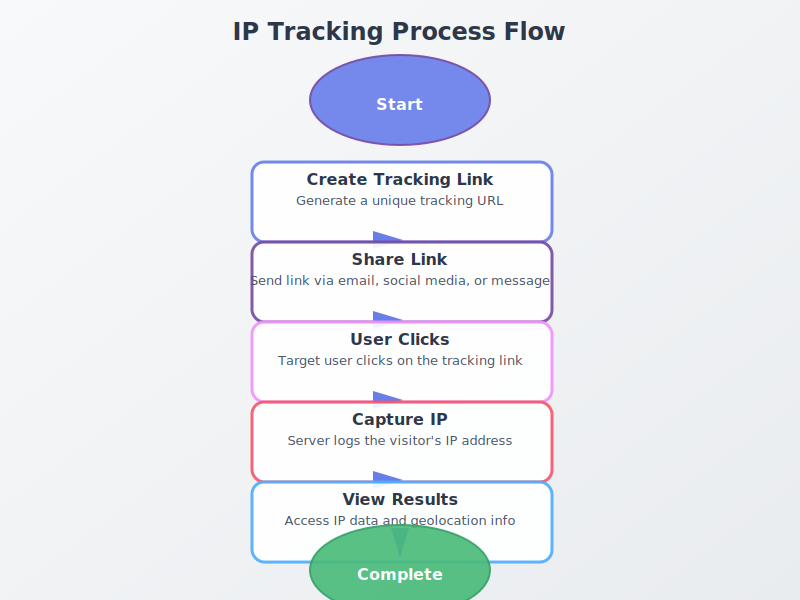

# SVG流程图使用指南

## 📁 文件夹结构

```
diagrams/
├── en/                    # 英文文章的流程图
│   ├── ip-tracking-process-flow.svg
│   └── ...
├── zh/                    # 中文文章的流程图
│   ├── ip-tracking-process-flow.svg
│   └── ...
└── templates/             # SVG模板
    ├── process-flow-template.svg
    ├── comparison-template.svg
    └── decision-tree-template.svg
```

## 🎨 流程图类型

### 1. 流程类（Process Flow）
用于展示步骤性流程，如：
- IP追踪流程
- 邮件追踪流程
- PDF追踪流程
- 用户注册流程

**示例文件：** `templates/process-flow-template.svg`

### 2. 对比类（Comparison）
用于对比不同选项、方法或工具：
- IP Tracker vs IP Grabber
- 不同追踪方法对比
- 工具功能对比

**示例文件：** `templates/comparison-template.svg`

### 3. 决策树（Decision Tree）
用于展示决策流程：
- 如何选择追踪方法
- 合规性检查流程
- 问题排查流程

**示例文件：** `templates/decision-tree-template.svg`

## 🛠️ 生成流程图

### 方法1：使用Python脚本

```bash
# 生成IP追踪流程图
python3 diagrams/generate_diagram.py
```

### 方法2：使用模板手动编辑

1. 复制对应的模板文件
2. 使用文本编辑器或SVG编辑器修改
3. 推荐工具：
   - **在线编辑器：** https://boxy-svg.com/
   - **桌面工具：** Inkscape (免费), Figma (在线)
   - **代码编辑器：** VS Code + SVG Preview插件

### 方法3：使用Draw.io

1. 访问 https://app.diagrams.net/
2. 创建新图表
3. 设计完成后导出为SVG
4. 保存到对应的 `en/` 或 `zh/` 文件夹

## 📝 命名规范

流程图文件名应与对应的文章文件名一致（去掉.html后缀）：

```
文章: blog/ip-tracker-how-to-find-someones-ip-complete-guide.html
流程图: diagrams/en/ip-tracker-how-to-find-someones-ip-complete-guide.svg
```

## 🎯 在文章中使用流程图

### HTML代码示例

```html
<figure class="diagram-container" style="margin: 2rem 0; text-align: center;">
  
  <figcaption style="margin-top: 1rem; color: #4a5568; font-size: 0.9rem;">
    IP追踪流程图：从创建追踪链接到获取IP地址的完整过程
  </figcaption>
</figure>
```

### 响应式设计

```html
<figure class="diagram-container">
  
  <figcaption>流程图说明文字</figcaption>
</figure>

<style>
.diagram-responsive {
  width: 100%;
  max-width: 800px;
  height: auto;
  display: block;
  margin: 0 auto;
}
</style>
```

## ✨ 设计规范

### 颜色方案
- **主色：** #667eea (紫色)
- **次色：** #764ba2 (深紫色)
- **成功色：** #48bb78 (绿色)
- **警告色：** #f5576c (红色)
- **背景：** #f8f9fa (浅灰)

### 字体
- **主字体：** Inter, sans-serif
- **标题大小：** 24px
- **正文大小：** 14px
- **说明文字：** 12px

### 尺寸建议
- **标准流程图：** 800x600px (viewBox)
- **复杂流程图：** 1000x700px
- **对比图：** 900x600px
- **决策树：** 1000x700px

### 无障碍访问
- 添加 `aria-label` 属性
- 确保颜色对比度符合WCAG标准
- 为关键元素添加描述性文本

## 📋 检查清单

创建流程图前，确认：
- [ ] 文件名与文章文件名一致
- [ ] 保存到正确的语言文件夹（en/zh）
- [ ] 使用响应式viewBox
- [ ] 添加适当的alt文本
- [ ] 颜色符合设计规范
- [ ] 文件大小 < 50KB（如可能）
- [ ] 测试在不同设备上的显示效果

## 🔧 优化SVG文件

### 使用SVGO优化

```bash
# 安装SVGO
npm install -g svgo

# 优化单个文件
svgo diagrams/en/ip-tracking-process-flow.svg

# 批量优化
svgo -f diagrams/en/
```

### 手动优化技巧
1. 移除不必要的元数据
2. 合并重复的样式定义
3. 使用 `<use>` 标签复用元素
4. 压缩路径数据

## 📚 示例流程图

### 已生成的流程图
- ✅ `ip-tracking-process-flow.svg` (中英文)

### 待生成的流程图建议
- IP地址基础知识图解
- IP追踪 vs IP抓取对比图
- 邮件追踪流程
- PDF追踪架构图
- 合规性检查决策树
- 客户旅程地图

## 💡 最佳实践

1. **保持简洁：** 每个流程图专注于一个主题
2. **使用图标：** 适当使用图标增强理解
3. **颜色编码：** 使用颜色区分不同类型的信息
4. **添加说明：** 在文章中添加图表的文字说明
5. **测试显示：** 在不同设备和浏览器上测试
6. **定期更新：** 随着内容更新，同步更新流程图

## 🆘 常见问题

**Q: SVG文件太大怎么办？**
A: 使用SVGO工具优化，或简化设计，减少复杂路径。

**Q: 如何在移动端显示更好？**
A: 使用响应式viewBox，确保在img标签中设置max-width: 100%。

**Q: 可以添加动画吗？**
A: 可以，使用SVG的`<animate>`标签，但要考虑性能影响。

**Q: 如何确保颜色一致性？**
A: 使用CSS变量或预定义的颜色方案。

---

*最后更新：2025-01-15*
